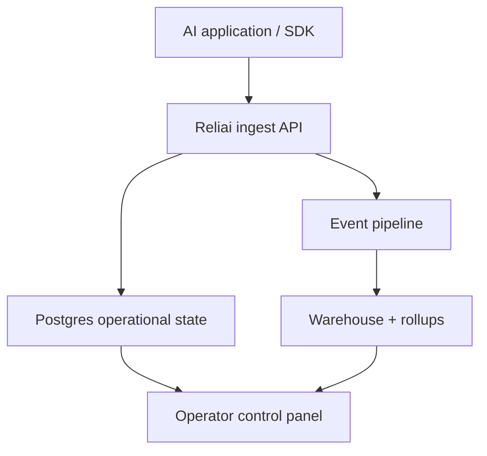

# Reliai

AI observability and reliability control plane for tracing AI systems, detecting incidents, applying guardrails, and analyzing production failures.


---

## What is Reliai?

Reliai is an AI observability platform for LLM tracing, RAG debugging, AI monitoring, LLM reliability, and agent tracing.

It is built for teams that need to:

- trace AI requests and pipeline spans
- detect AI regressions before users do
- investigate incidents with trace graphs and comparisons
- apply runtime guardrails and deployment safety checks

This repository is the core open platform repo. The Python SDK is being separated into its own public repository. The Node SDK currently remains in-tree and is planned for a later extraction.

---

## Quickstart (30 seconds)

Start the local infrastructure:

```bash
docker compose up -d
```

Then run the platform:

```bash
make db-migrate
make seed
make dev
pnpm --filter web dev --port 3000
```

The control panel appears at:

`http://localhost:3000`

---

## What you see after installing Reliai

As soon as your application starts sending traces, Reliai automatically gives operators a production view of:

- AI trace graphs
- retrieval spans
- guardrail triggers
- incident detection
- deployment regression detection


---

## Admin Access (Internal)

Reliai uses a gated CLI for system admin elevation. This path is disabled by default.

```bash
RELIAI_ADMIN_CLI_ENABLED=true \
python -m reliai.cli admin grant \
  --email user@company.com \
  --confirm \
  --reason "on-call escalation"
```

All actions are recorded in the `audit_events` table with actor attribution and reason.

---

## Example Output

Control panel:


Trace graph:


Incident investigation:


---

## Used By

Used by engineers building AI systems in production.

<!-- Add logos or company names here as adoption grows -->

---

## Features

- AI observability and LLM tracing
- RAG debugging and agent tracing
- regression detection and incident management
- runtime guardrails and deployment safety gates
- operator control panel and trace investigation
- internal growth and reliability analytics

---

## What's New

- (2026-03-25) Added LangGraph agent example with guardrail tracing
- (2026-03-17) Added zero-config init with RELIAI_AUTO_INSTRUMENT environment variable support
- (2026-03-11) Launched one-command demo — `docker compose up` runs the full stack

---

## Featured Example

**[fastapi-rag](./examples/fastapi-rag)** — FastAPI + retriever + LLM with retrieval spans and latency breakdown per step.

---

## Architecture



Core directories:

- `/apps/web`
- `/apps/api`
- `/docs`
- `/scripts`
- `/infra`

---

## Examples

Planned public ecosystem:

- `reliai-python`
- `reliai-demo`
- `reliai-examples`
- `reliai-rag-starter`
- `reliai-agent-starter`

Local repo-split scaffolds live in:

- [`repo-templates/`](/Users/robert/Documents/Reliai/repo-templates)

---

## Documentation

- [Current state](/Users/robert/Documents/Reliai/docs/04-current-state.md)
- [Product capabilities](/Users/robert/Documents/Reliai/docs/product-capabilities.md)
- [Repo separation plan](/Users/robert/Documents/Reliai/docs/repo-separation-plan.md)

---

## Community

- [Contributing](/Users/robert/Documents/Reliai/CONTRIBUTING.md)
- [Code of Conduct](/Users/robert/Documents/Reliai/CODE_OF_CONDUCT.md)

---

## License

MIT
