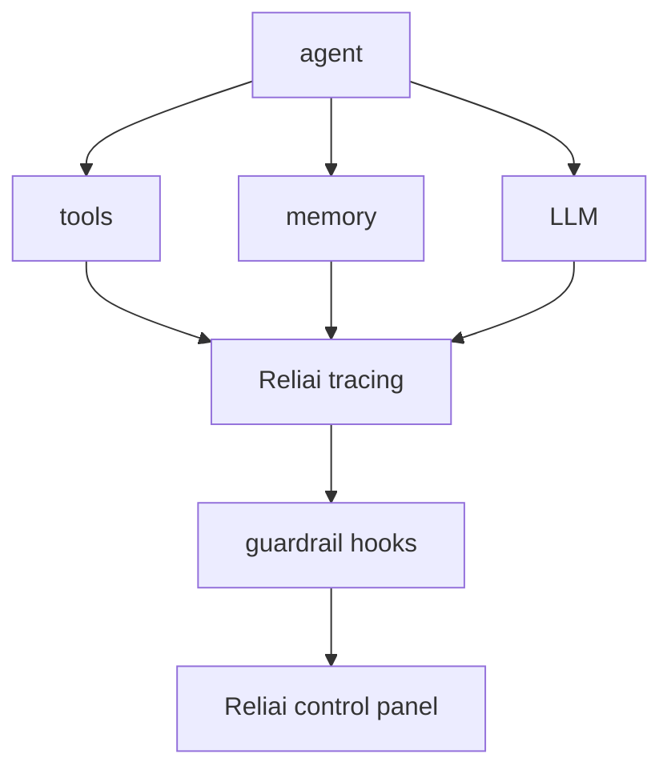

# Reliai Agent Starter


Production-ready agent template with full Reliai observability wired in from day one.


> A production agent scaffold with Reliai tracing, tool spans, memory tracking, and guardrail hooks already wired in.

---

## Quickstart

```bash
git clone https://github.com/reliai/reliai-agent-starter
cd reliai-agent-starter
docker compose up
```

Open **http://localhost:3000** to see agent traces appear.

---

## What's New

- (2026-03-25) Added LangGraph agent example with guardrail tracing
- (2026-03-17) Added guardrail hook examples with retry tracing
- (2026-03-11) Launched one-command demo — `docker compose up` runs the full stack

---

## What You Will See

**Agent trace graph** — every reasoning step, tool call, and memory read is a span. The trace graph shows the full decision path from query to response.

**Tool execution spans** — each tool call is traced with latency, input, and output. Timeouts and retries are captured automatically.

**Guardrail checks** — guardrail hooks fire after LLM completions and before responses are returned. Blocked outputs and retries both appear in the trace.

**Incident detection** — repeated tool failures or guardrail blocks surface as incidents in the control panel with recommended actions.

---

## Architecture



---

## Structure

| Directory | Role |
|---|---|
| `agent/` | Agent orchestration logic |
| `tools/` | Tool definitions and execution |
| `memory/` | Memory read/write layer |
| `reliai-hooks/` | Guardrail and tracing hooks |

---

## Next Steps

- [reliai-python](https://github.com/reliai/reliai-python) — SDK docs and advanced instrumentation
- [reliai-demo](https://github.com/reliai/reliai-demo) — run the full Reliai platform locally in 60 seconds
- [reliai-examples](https://github.com/reliai/reliai-examples) — copy-paste integration examples
- [Documentation](https://reliai.dev/docs) — platform docs and API reference
- [CONTRIBUTING.md](./CONTRIBUTING.md) — how to contribute

---

## License

MIT
