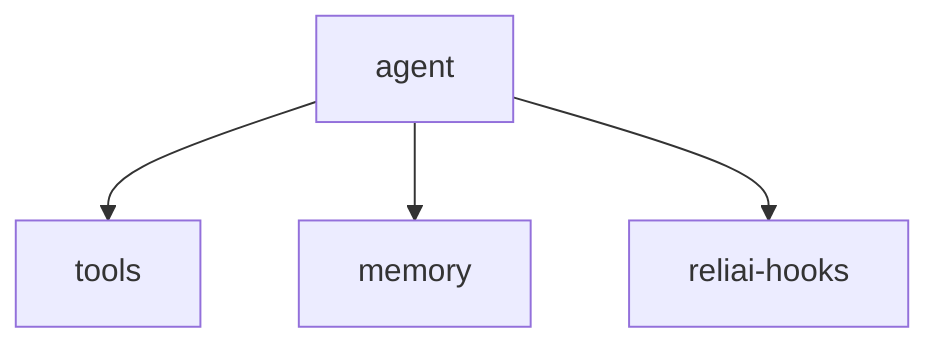

# Reliai Agent Starter

Production-style agent starter for AI observability, LLM tracing, AI monitoring, LLM reliability, and agent tracing.


---

## What is Reliai?

This starter shows how to trace agent steps, tool execution, retries, and guardrail checks in a production-style agent app.

---

## Quickstart (30 seconds)

```bash
git clone https://github.com/reliai/reliai-agent-starter
docker compose up
```

---

## What you see after installing Reliai

The starter turns agent traffic into:

- AI trace graphs
- retrieval spans
- guardrail triggers
- incident detection
- deployment regression detection


---

## Example Output


---

## Features

- agent reasoning loops
- tool calls
- retries
- guardrail checks

---

## Architecture



---

## Examples

See `agent/`, `tools/`, `memory/`, and `reliai-hooks/`.

---

## Documentation

See the platform repo and starter README.

---

## Community

See `CONTRIBUTING.md`.

---

## License

MIT
