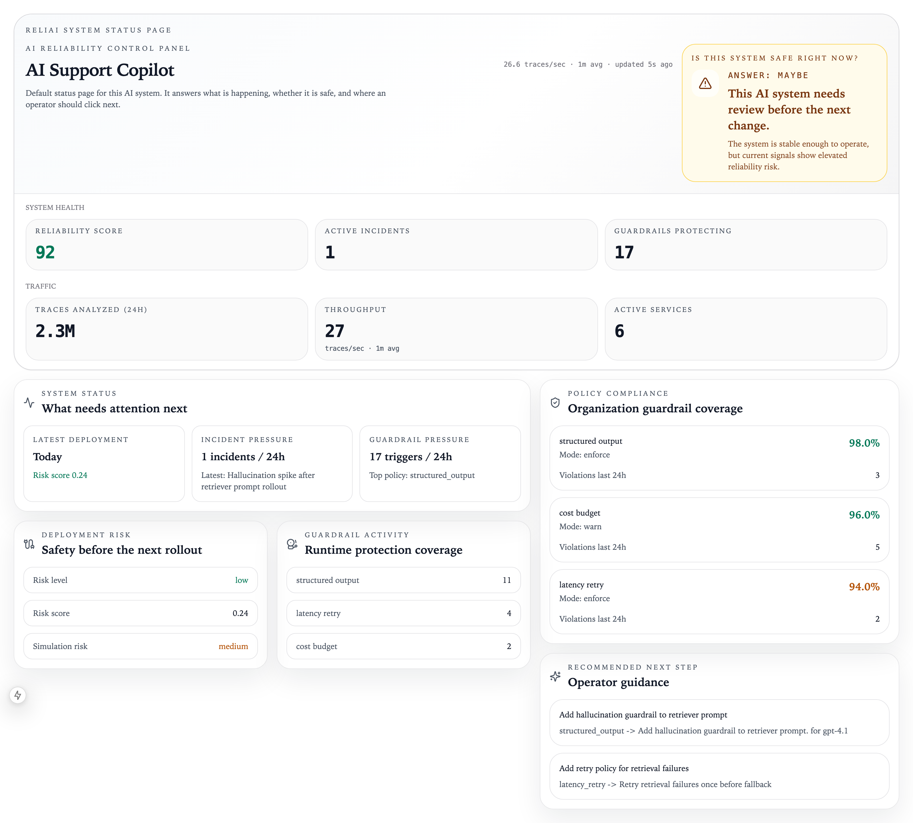
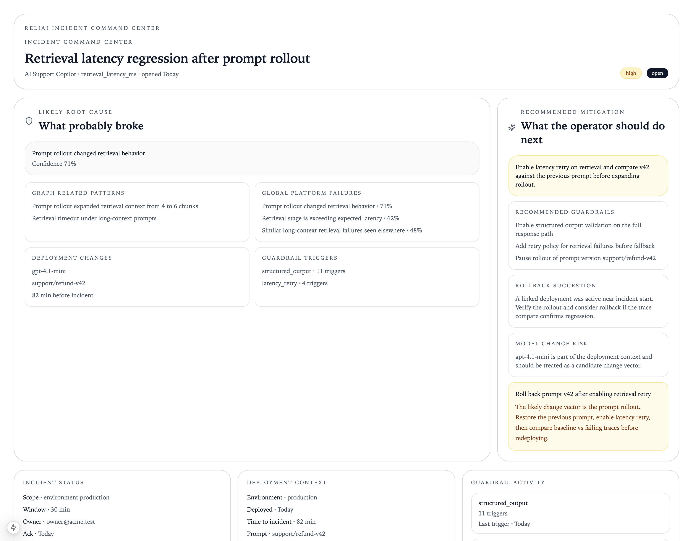

# Reliai Demo


Clone and run the full Reliai stack locally in under 60 seconds.



> The full Reliai platform running locally with live AI traffic — traces appear on the dashboard within 60 seconds.

---

## Run the Demo in 60 Seconds

```bash
git clone https://github.com/reliai/reliai-demo
cd reliai-demo
docker compose up
```

Open **http://localhost:3000**

The dashboard populates within 60 seconds. No API keys, no configuration.

---

## What's New

- (2026-03-25) Added LangGraph agent example with guardrail tracing
- (2026-03-17) Added guardrail retry simulation — blocked spans and retries both appear in trace graph
- (2026-03-11) Expanded synthetic traffic to 16 query types across RAG, tool, and LLM categories

---

## What You Will See

**AI trace graph** — every request rendered as a graph of spans: retrieval → tool → LLM → guardrail. Click any trace to see latency, inputs, outputs, and metadata at each step.

**Guardrail retries** — when a hallucination is detected the guardrail blocks the response and the traffic generator immediately retries with a corrected prompt. Both the blocked span and the successful retry appear in the trace graph.

**Incident detection** — repeated guardrail triggers surface as incidents. Reliai opens an incident, assigns a severity, and links it to the traces that caused it. The incident command center shows the full timeline.

**Operator guidance** — the control panel surfaces deployment regressions and recommended actions: which prompt version changed, what the retriever returned before vs. after, and what to roll back.



---

## Architecture

```
┌─────────────────────────────────────────────────────────┐
│                     docker compose up                   │
│                                                         │
│  traffic-generator                                      │
│       │  (RAG queries, tool calls, failure scenarios)   │
│       ▼                                                 │
│    agent ──────────► retriever  (vector search)         │
│       │                                                 │
│       ├──────────► tools       (deployment lookup)      │
│       │                                                 │
│       └──────────► LLM span    (simulated completion)   │
│                        │                                │
│                    guardrail   (policy check)           │
│                        │                                │
│                        ▼                                │
│              Reliai API  :8000                          │
│         (trace ingestion, incident detection,           │
│          regression scoring, alert delivery)            │
│                        │                                │
│              Reliai Web  :3000                          │
│         (control panel, trace explorer,                 │
│          incident command center)                       │
└─────────────────────────────────────────────────────────┘
```

**Services started by `docker compose up`:**

| Service | Port | Role |
|---|---|---|
| `postgres` | 5432 | primary datastore |
| `redis` | 6379 | task queue + cache |
| `api` | 8000 | Reliai API — ingestion, scoring, alerts |
| `worker` | — | RQ worker — async evaluation jobs |
| `web` | 3000 | control panel |
| `retriever` | 8011 | demo vector search service |
| `tools` | 8012 | demo tool execution service |
| `agent` | 8010 | demo agent — orchestrates retriever, tools, LLM |
| `traffic-generator` | — | continuous synthetic workload |

---

## Example Trace Investigation

Open any trace in the explorer at **http://localhost:3000/traces**. The trace graph shows every span in order:

```
traffic_cycle
  └── request (agent)
        ├── retrieval (retriever)
        │     └── retrieval_backend
        ├── tool_execution (tools)
        │     └── tool_backend
        ├── llm_response
        └── guardrail_check
              └── [guardrail_retry]  ← appears when a policy fires
```

The control panel at **http://localhost:3000/dashboard** shows the incident queue, regression timeline, and deployment risk score as traffic accumulates.

---

## Makefile

```bash
make dev     # docker compose up --build
make stop    # docker compose down
make logs    # tail traffic-generator and agent logs
make pull    # pull latest platform images
```

---

## Traffic Patterns

The generator runs continuously and produces a realistic mixed workload:

| Pattern | Rate |
|---|---|
| RAG queries (retriever + LLM) | ~85% of traffic |
| Tool-assisted queries | ~85% include tool call |
| Hallucination + guardrail block | ~8% of requests |
| Guardrail retry (auto) | every blocked request |
| Retrieval failure | ~2% |
| Tool timeout | ~1.5% |

An initial burst of 15 concurrent traces is sent on startup so the dashboard shows data immediately.

---

## Next Steps

**Instrument your own app** — install the SDK and send real traces in minutes:

```bash
pip install reliai-python
```

```python
import reliai

reliai.init(project="my-project")

with reliai.span("my_llm_call") as span:
    response = openai.chat.completions.create(...)
    span.set_trace_fields(
        model="gpt-4.1",
        provider="openai",
        input_text=prompt,
        output_text=response.choices[0].message.content,
        latency_ms=elapsed_ms,
    )
```

**Resources:**

- [reliai-python SDK](https://github.com/reliai/reliai-python) — Python instrumentation
- [reliai-node SDK](https://github.com/reliai/reliai-node) — Node.js instrumentation
- [Reliai platform](https://github.com/reliai/reliai) — self-host the full stack
- [Documentation](https://reliai.dev/docs)

---

## License

MIT
