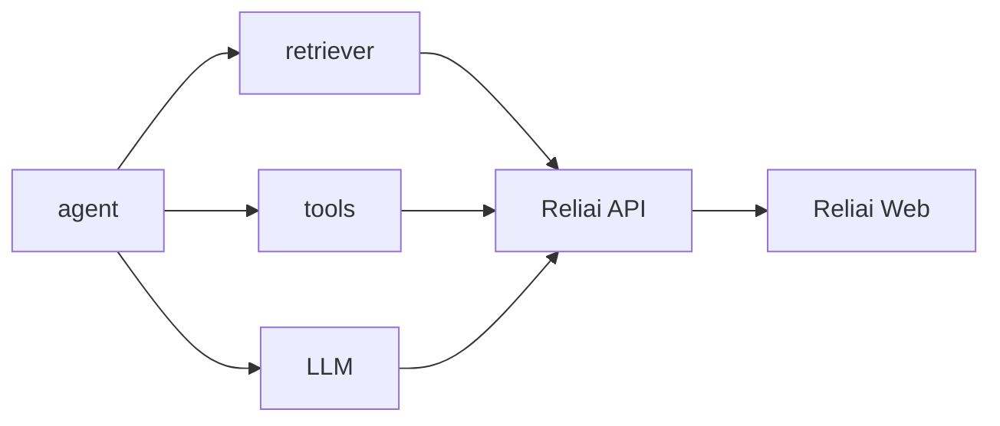

# Reliai Demo

Run a production-like AI system locally in 60 seconds.

## Run the Demo in 60 Seconds

```bash
git clone https://github.com/reliai/reliai-demo
cd reliai-demo
docker compose up
```

Open `http://localhost:3000`

Makefile shortcuts:

```bash
make dev   # docker compose up --build
make stop  # docker compose down
```

On startup you will see:

```
Reliai demo running.

Dashboard:
http://localhost:3000
```

## What You Will See

- AI trace graph with nested spans for retrieval, tools, LLM, and guardrails
- guardrail retries that show blocked spans followed by safe retry spans
- incident detection when guardrail failures spike
- operator guidance highlighting what changed and what to fix

## Architecture



## Example Trace Investigation


Open a trace to see the full span tree, latency, and guardrail metadata in one place.

## Next Steps

- reliai-python SDK: https://github.com/reliai/reliai-python
- Examples repo: https://github.com/reliai/reliai-examples
- Starter kits: https://github.com/reliai/reliai-rag-starter and https://github.com/reliai/reliai-agent-starter
