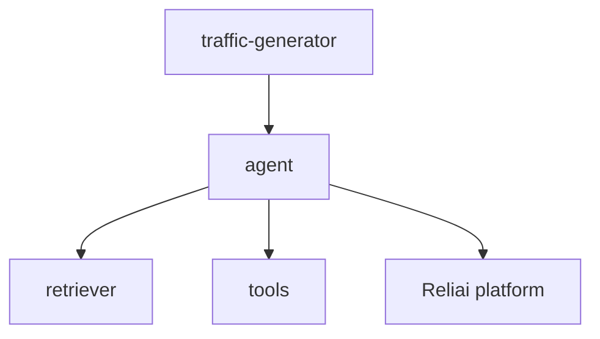

# Reliai Demo

Runnable synthetic telemetry demo for AI observability, LLM tracing, RAG debugging, AI monitoring, and agent tracing.


---

## What is Reliai?

Reliai Demo is a small environment that produces realistic AI traces, tool spans, and failure patterns for demos and testing.

---

## Quickstart (30 seconds)

```bash
docker compose up
```

Then open:

`http://localhost:3000`

---

## What you see after installing Reliai

The demo fills Reliai with a realistic mixed system state, including:

- AI trace graphs
- retrieval spans
- guardrail triggers
- incident detection
- deployment regression detection


---

## Example Output


---

## Features

- RAG-style requests
- agent reasoning loops
- tool execution
- guardrail failures
- hallucination incidents

---

## Architecture



---

## Examples

Use with the main platform repo at `github.com/reliai/reliai`.

---

## Documentation

The `traffic-generator` service continuously drives low-volume synthetic traffic. If a local Reliai platform is running, traces are sent to `http://host.docker.internal:8000`. Otherwise the SDK falls back to console logging so the demo still shows trace activity in logs.

---

## Community

See `CONTRIBUTING.md`.

---

## License

MIT
