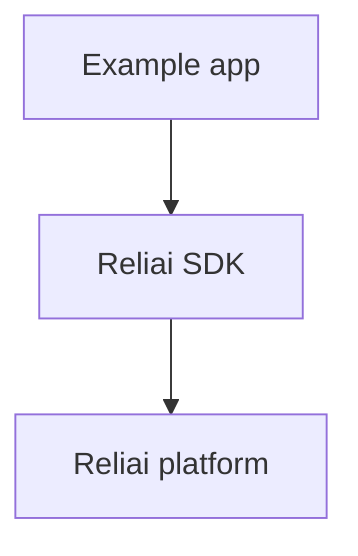

# Reliai Examples

Small copy-paste examples for AI observability, LLM tracing, RAG debugging, AI monitoring, and agent tracing.


---

## What is Reliai?

This repo contains small reference integrations developers can copy into their own AI systems.

---

## Quickstart (30 seconds)

```bash
cd examples/simple-llm
pip install -r requirements.txt
python app.py
```

---

## What you see after installing Reliai

Each example is designed to immediately surface:

- AI trace graphs
- retrieval spans
- guardrail triggers
- incident detection
- deployment regression detection


---

## Example Output


---

## Features

- FastAPI RAG example
- LangGraph-style agent example
- evaluation pipeline example
- simple LLM tracing example

---

## Architecture



---

## Examples

- `examples/fastapi-rag`
- `examples/langgraph-agent`
- `examples/evaluation-pipeline`
- `examples/simple-llm`

---

## Documentation

See the README inside each example.

---

## Community

See `CONTRIBUTING.md`.

---

## License

MIT
