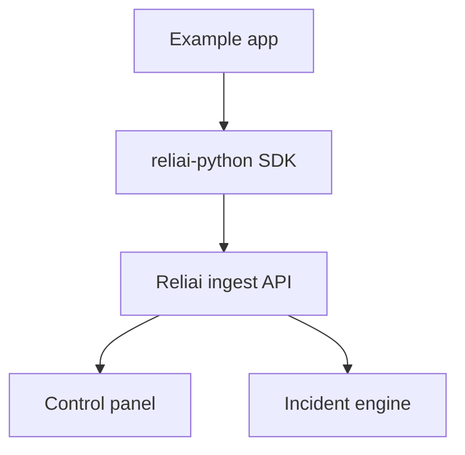

# Reliai Examples


Copy-paste integrations for OpenAI, FastAPI RAG, LangGraph agents, and evaluation pipelines.


> Reference integrations for the most common AI stacks — copy, run, and adapt.

---

## Quickstart

```bash
git clone https://github.com/reliai/reliai-examples
cd reliai-examples/examples/simple-llm
pip install -r requirements.txt
python app.py
```

Open **http://localhost:3000** to see the trace appear.

---

## What's New

- (2026-03-25) Added LangGraph agent example with guardrail tracing
- (2026-03-17) Added LangGraph agent example with guardrail tracing
- (2026-03-11) Added evaluation pipeline example with regression scoring

---

## Featured Example

**[fastapi-rag](./examples/fastapi-rag)** — FastAPI + retriever + LLM with retrieval spans and latency breakdown per step.

---

## What You Will See

**Trace graph** — each example emits a complete trace: every function call, retrieval step, LLM call, and tool use is a labeled span with latency and payload captured.

**Incident detection** — run the evaluation pipeline example and Reliai will score outputs and flag quality regressions automatically.

**Guardrail triggers** — the agent example includes guardrail spans so you can see how Reliai surfaces blocked outputs and retries.

---

## Examples

| Directory | What it demonstrates |
|---|---|
| `examples/simple-llm` | Minimal LLM call traced with `@reliai.trace` |
| `examples/fastapi-rag` | FastAPI + retriever + LLM with retrieval spans |
| `examples/langgraph-agent` | LangGraph agent with tool calls and guardrail hooks |
| `examples/evaluation-pipeline` | Batch evaluation with regression scoring |

Each example has its own README with setup instructions.

---

## Architecture



---

## Next Steps

- [reliai-python](https://github.com/reliai/reliai-python) — full SDK docs and instrumentation options
- [reliai-demo](https://github.com/reliai/reliai-demo) — run the complete Reliai platform locally in 60 seconds
- [Documentation](https://reliai.dev/docs) — integration guides
- [CONTRIBUTING.md](./CONTRIBUTING.md) — how to add an example

---

## License

MIT
