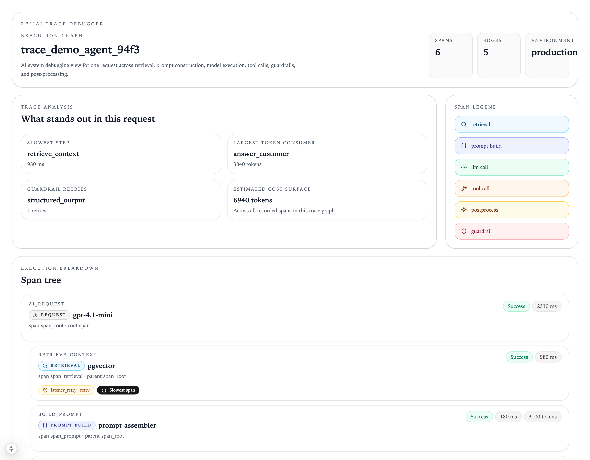
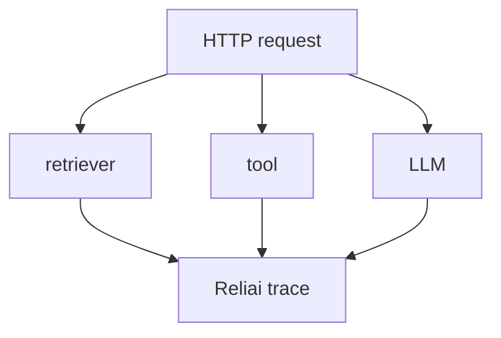

# Reliai Python


Drop-in SDK for Python apps — instrument OpenAI, Anthropic, LangChain, or any LLM in minutes.



> Instrument any Python LLM app in one import. See traces, incidents, and regressions in the Reliai control panel.

---

## Quickstart

```bash
pip install reliai
```

```python
import reliai

reliai.init()

@reliai.trace
def retrieve_docs(query: str) -> list[str]:
    return [f"Document about {query}"]

@reliai.trace
async def call_llm(prompt: str) -> str:
    return f"Echo: {prompt}"
```

Open **http://localhost:3000** to see traces appear.

---

## What's New

- (2026-03-25) Added LangGraph agent example with guardrail tracing
- (2026-03-17) Added zero-config auto-instrumentation for FastAPI and LangChain
- (2026-03-11) Launched one-command demo — `docker compose up` runs the full stack

---

## What You Will See

**Trace graph** — every decorated function becomes a span. Nested calls produce a graph: retriever → LLM → guardrail. Latency, inputs, and outputs are captured automatically.

**Incident detection** — when failures cluster, Reliai opens an incident and links the relevant traces. No alert configuration required for the defaults.

**Regression scoring** — each deployment is scored against the prior output baseline. Quality drops surface on the control panel before users notice.

---

## Automatic Framework Instrumentation

```python
import reliai

reliai.init()
reliai.auto_instrument()
```

Automatically instruments FastAPI, OpenAI SDK, Anthropic SDK, and LangChain — no decorators required.



---

## Zero-Code CLI Instrumentation

```bash
pip install reliai
reliai-run uvicorn app:app
```

Traces FastAPI requests, LangChain chains, LLM calls, and tool execution without any code changes.

---

## Environment Bootstrap

```bash
export RELIAI_AUTO_INSTRUMENT=true
python app.py
```

Loads Reliai at interpreter startup — no import needed in your application code.

---

## Share Investigation Links

When a slow trace or error is captured, Reliai prints a direct link:

```
Reliai trace captured

Investigate: https://app.reliai.dev/traces/abc123
```

Paste into a Slack thread and the whole team lands on the same trace.

---

## Examples

- `examples/openai_basic.py` — manual span instrumentation
- `examples/anthropic_basic.py` — Anthropic SDK tracing
- `examples/langchain_basic.py` — LangChain chain tracing
- `examples/fastapi_app.py` — FastAPI request tracing
- `examples/openai_auto.py` — zero-config auto-instrument
- `examples/langchain_auto.py` — LangChain auto-instrument
- `examples/fastapi_auto.py` — FastAPI auto-instrument

---

## Next Steps

- [reliai-demo](https://github.com/reliai/reliai-demo) — run the full Reliai stack locally in 60 seconds
- [reliai-examples](https://github.com/reliai/reliai-examples) — copy-paste integrations for common stacks
- [Documentation](https://reliai.dev/docs) — full SDK reference
- [CONTRIBUTING.md](./CONTRIBUTING.md) — how to contribute

---

## License

MIT
