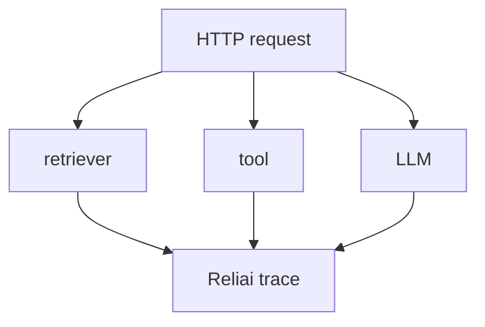
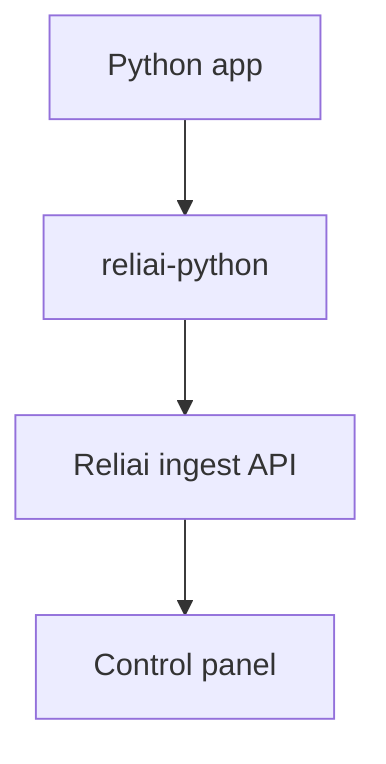

# Reliai Python

Python instrumentation SDK for AI observability, LLM tracing, RAG debugging, AI monitoring, and LLM reliability.


---

## What is Reliai?

Reliai helps developers trace AI systems, detect failures, and keep production AI systems reliable.

---

## Quickstart (30 seconds)

```bash
pip install reliai
```

```python
import reliai

reliai.init()

@reliai.trace
def retrieve_docs(query: str) -> list[str]:
    return [f"Document about {query}"]

@reliai.trace
async def call_llm(prompt: str) -> str:
    return f"Echo: {prompt}"
```

---

## What you see after installing Reliai

After installation, Reliai automatically gives you:

- AI trace graphs
- retrieval spans
- guardrail triggers
- incident detection
- deployment regression detection


---

## Example Output


---

## Automatic Framework Instrumentation

```python
import reliai

reliai.init()
reliai.auto_instrument()
```

This automatically instruments:

- FastAPI
- OpenAI SDK
- LangChain
- agent frameworks built on traced tool and LLM calls

No decorators required.



---

## Zero-Code Application Instrumentation

```bash
pip install reliai
reliai-run uvicorn app:app
```

Reliai will automatically trace:

- FastAPI requests
- LangChain chains
- LLM calls
- tool execution

No code changes required.

---

## Automatic App Instrumentation

You can also enable startup-time tracing with environment-only bootstrap:

```bash
export RELIAI_AUTO_INSTRUMENT=true
python app.py
```

This loads Reliai during interpreter startup and applies `reliai.init()` plus `reliai.auto_instrument()` before your app code runs.

---

## Share Investigation Links

When an error or slow trace is captured, Reliai prints a direct investigation link:

```text
Reliai trace captured

Investigate:
https://app.reliai.dev/traces/abc123
```

Engineers often paste these links into Slack threads during incidents so the whole team lands on the same trace immediately.

---

## Features

- zero-config `@reliai.trace` decorator
- automatic framework instrumentation
- zero-code CLI instrumentation
- tracing and spans
- OpenAI instrumentation
- Anthropic instrumentation
- LangChain instrumentation
- FastAPI integration

---

## Architecture



---

## Examples

- `examples/openai_basic.py`
- `examples/anthropic_basic.py`
- `examples/langchain_basic.py`
- `examples/fastapi_app.py`
- `examples/openai_auto.py`
- `examples/langchain_auto.py`
- `examples/fastapi_auto.py`

---

## Documentation

See the core platform docs at `github.com/reliai/reliai`.

---

## Community

See `CONTRIBUTING.md`.

---

## License

MIT
