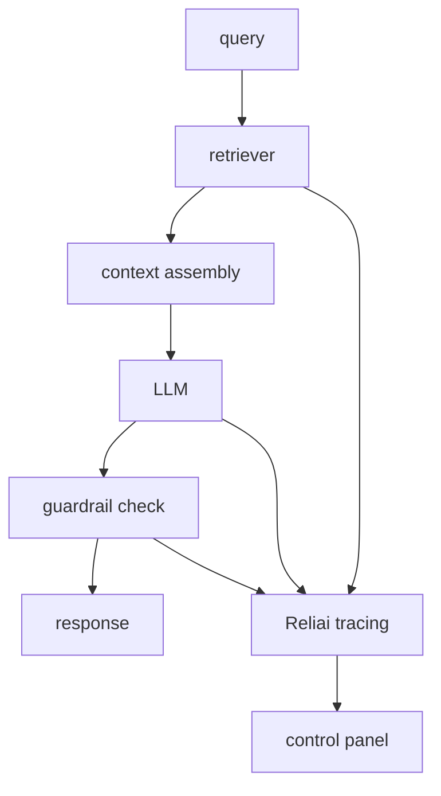

# Reliai RAG Starter


Production-ready RAG template with retrieval tracing, guardrail coverage, and regression detection.


> A production RAG scaffold with retrieval tracing, reranker spans, and Reliai regression detection ready to go.

---

## Quickstart

```bash
git clone https://github.com/reliai/reliai-rag-starter
cd reliai-rag-starter
docker compose up
```

Open **http://localhost:3000** to see RAG traces appear.

---

## What's New

- (2026-03-25) Added LangGraph agent example with guardrail tracing
- (2026-03-17) Added reranker span support with latency breakdown
- (2026-03-11) Launched one-command demo — `docker compose up` runs the full stack

---

## What You Will See

**Retrieval spans** — every vector search is a span with query text, retrieved chunks, latency, and source count. Slow retrievals and empty results are highlighted.

**Context assembly trace** — the full pipeline from query → retriever → context → LLM → response is rendered as a graph. Click any span to inspect what was passed to the LLM.

**Regression detection** — Reliai scores each deployment against the prior retrieval quality baseline. If a prompt change degrades citation accuracy, it flags it before users notice.

**Guardrail coverage** — unsupported claims and hallucinations are caught by guardrail hooks before responses are returned. Blocked outputs appear in the trace for investigation.

---

## Architecture



---

## Structure

| Directory | Role |
|---|---|
| `app/` | Application entry point and query handling |
| `retriever/` | Vector search and context retrieval |
| `vector-db/` | Vector database configuration |
| `reliai-instrumentation/` | Tracing hooks and guardrail policies |

---

## Next Steps

- [reliai-python](https://github.com/reliai/reliai-python) — SDK docs and advanced instrumentation
- [reliai-demo](https://github.com/reliai/reliai-demo) — run the full Reliai platform locally in 60 seconds
- [reliai-examples](https://github.com/reliai/reliai-examples) — copy-paste integration examples
- [Documentation](https://reliai.dev/docs) — platform docs and API reference
- [CONTRIBUTING.md](./CONTRIBUTING.md) — how to contribute

---

## License

MIT
