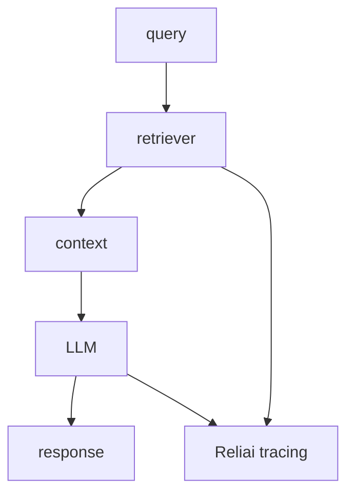

# Reliai RAG Starter

Production-style RAG starter for AI observability, LLM tracing, RAG debugging, AI monitoring, and LLM reliability.


---

## What is Reliai?

This starter shows how to build a traced RAG pipeline with retrieval, context assembly, LLM calls, and reliability hooks.

---

## Quickstart (30 seconds)

```bash
git clone https://github.com/reliai/reliai-rag-starter
docker compose up
```

---

## What you see after installing Reliai

The starter automatically exposes:

- AI trace graphs
- retrieval spans
- guardrail triggers
- incident detection
- deployment regression detection


---

## Example Output


---

## Features

- retrieval pipeline
- vector-db boundary
- Reliai instrumentation
- RAG debugging visibility

---

## Architecture



---

## Examples

See `app/`, `retriever/`, `vector-db/`, and `reliai-instrumentation/`.

---

## Documentation

See the platform repo and starter README.

---

## Community

See `CONTRIBUTING.md`.

---

## License

MIT
