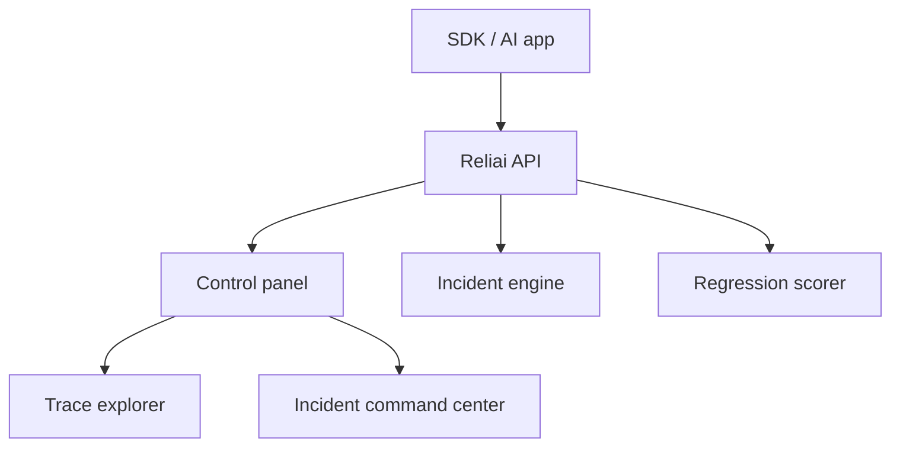

# Reliai


Used in production to monitor real AI systems and detect failures before users do.


> Detect, investigate, and prevent AI failures in production.

---

## Quickstart

```bash
git clone https://github.com/reliai/reliai-demo
cd reliai-demo
docker compose up
```

Open **http://localhost:3000**

---

## What's New

- (2026-03-25) Added LangGraph agent example with guardrail tracing
- (2026-03-17) Added LangGraph agent example with guardrail tracing
- (2026-03-11) Launched one-command demo — `docker compose up` runs the full stack

---

## What You Will See

**AI trace graph** — every request rendered as a graph of spans across retrieval, tool calls, LLM, and guardrail layers. Click any node to inspect inputs, outputs, and latency.

**Incident detection** — Reliai opens incidents automatically when failure patterns emerge. The incident command center shows affected traces, a severity score, and a recommended action.

**Guardrail triggers** — when a guardrail policy fires, the blocked span and the retry both appear in the trace so you can see exactly what changed.

**Deployment regressions** — the control panel scores each deployment against the prior baseline and flags output quality drops before they reach users.

---

## Architecture



---

## Examples

| Repo | What it shows |
|---|---|
| [reliai-demo](https://github.com/reliai/reliai-demo) | Full stack locally in 60 seconds |
| [reliai-python](https://github.com/reliai/reliai-python) | Python SDK — pip install and instrument |
| [reliai-examples](https://github.com/reliai/reliai-examples) | Copy-paste integrations for common stacks |
| [reliai-rag-starter](https://github.com/reliai/reliai-rag-starter) | Production RAG template with tracing wired in |
| [reliai-agent-starter](https://github.com/reliai/reliai-agent-starter) | Production agent template with tool tracing |

---

## Next Steps

- [reliai-python SDK](https://github.com/reliai/reliai-python) — instrument any Python LLM app in minutes
- [Documentation](https://reliai.dev/docs) — platform docs, API reference, integration guides
- [CONTRIBUTING.md](./CONTRIBUTING.md) — how to contribute

---

## License

MIT
