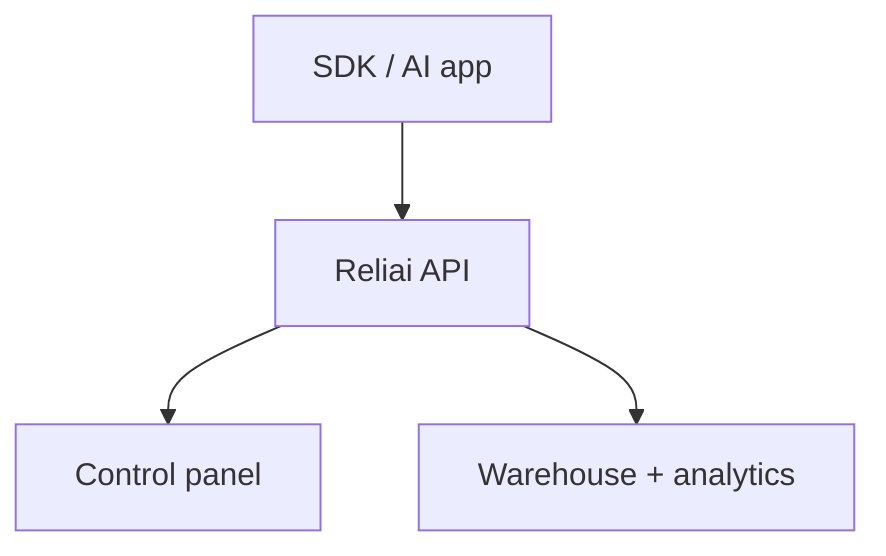

# Reliai

AI observability platform for tracing AI systems, incident detection, guardrails, and reliability analysis.


---

## What is Reliai?

Reliai is an AI observability and AI monitoring platform for LLM tracing, RAG debugging, LLM reliability, and agent tracing.

---

## Quickstart (30 seconds)

```bash
docker compose up
```

Then open:

`http://localhost:3000`

---

## What you see after installing Reliai

Reliai automatically turns live traffic into an operator surface with:

- AI trace graphs
- retrieval spans
- guardrail triggers
- incident detection
- deployment regression detection


---

## Example Output


---

## Features

- AI trace ingestion
- incident detection
- runtime guardrails
- trace graphs
- reliability analysis

---

## Architecture



---

## Examples

- `reliai-examples`
- `reliai-rag-starter`
- `reliai-agent-starter`

---

## Documentation

Platform docs live in `/docs`.

---

## Community

See `CONTRIBUTING.md`.

---

## License

MIT
